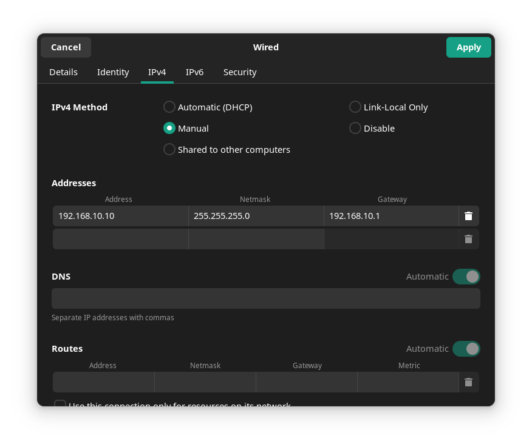

# NetJUCE

JUCE-based, multicast networked audio server.

The audio server is implemented in:
- A [console application](./src/console-app) (not currently operational)
- A [VST plugin](./src/wfs-plugin), which, with the addition of a multicast 
  control-data server, acts as a hub for a distributed real-time Wave Field
  Synthesis algorithm, with accompanying 
  [microcontroller-based client](https://github.com/hatchjaw/netjuce-teensy).

For software usage instructions, see the respective source directories. General
instructions can be found here:

- [Build](#build)
- [Network setup](#network-setup)
- [Audio setup](#audio-setup)

## Build

Build tested with JUCE 7.0.8. This project uses JUCE's
[CMake API](https://github.com/juce-framework/JUCE/blob/master/docs/CMake%20API.md).

### Generate the buildsystem

By default, the project is set up to use `find_package` to locate a
[global JUCE installation](https://github.com/juce-framework/JUCE/blob/master/docs/CMake%20API.md#using-find_package).
Specify the location of your installation of JUCE with the `JUCE_INSTALL_PATH`
flag:

```shell
cmake -DCMAKE_BUILD_TYPE=(Debug|Release) -DJUCE_INSTALL_PATH=/path/to/juce/install -B cmake-build
```

This will generate a buildsystem in directory `cmake-build`.

If you prefer to use `add_subdirectory`, download/clone JUCE as a subdirectory
of this directory, and modify [CMakeLists.txt](./CMakeLists.txt):

```cmake
#list(APPEND CMAKE_PREFIX_PATH ${JUCE_INSTALL_PATH})
#find_package(JUCE CONFIG REQUIRED)
add_subdirectory(JUCE)
```

### Build a target

To build, enter:

```shell
cmake --build cmake-build [--target <target>]
```

where `target` is one of `njConsole`, for the console application, or
`njWfsPlugin_(VST3|AU|Standalone)` for the plugin (or standalone plugin build).

Building `njWfsPlugin_(VST3|AU)` will install the plugin in the default
installation directory (e.g., for Linux, `~/.vst3/`).

## Network setup

Connect your computer to an ethernet switch. Open the settings for your wired
connection, and configure IPv4 manually (i.e. no DHCP). E.g. on Linux (with 
GNOME desktop), that looks as follows:



Most important is that the _Address_ for the local network adaptor matches 
`networkAdapterIPAddress` as delivered to the 
[constructor](https://github.com/hatchjaw/netjuce-teensy/blob/bd19f4084df308d52576511cdc030bc8a60c7615/src/NetJUCEClient.h#L56) 
of `NetJUCEClient` in the `netjuce-teensy` project.

### Audio setup

Teensy 4.1 runs at an audio sampling rate of 44.1 kHz, so that is the rate at
which your audio software or DAW should run. Your audio software's buffer size 
should match the `AUDIO_BLOCK_SAMPLES` value specified in `netjuce-teensy`'s 
[platformio.ini](https://github.com/hatchjaw/netjuce-teensy/blob/bd19f4084df308d52576511cdc030bc8a60c7615/platformio.ini#L17).
To maximise the number of audio channels you can send, and minimise client
asynchronicity, use a small buffer of 64 or 32 frames.
