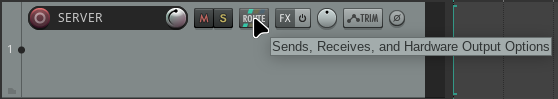
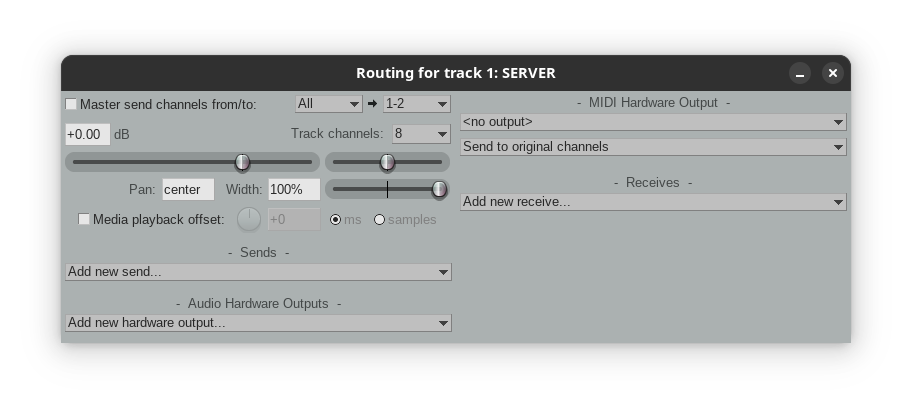
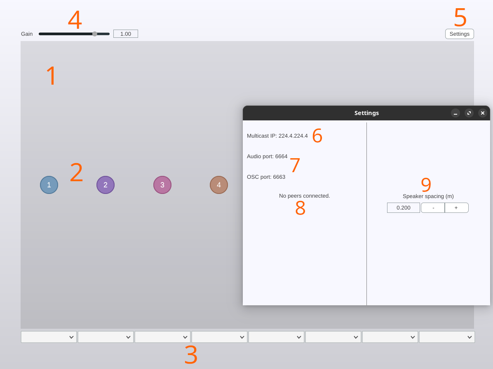
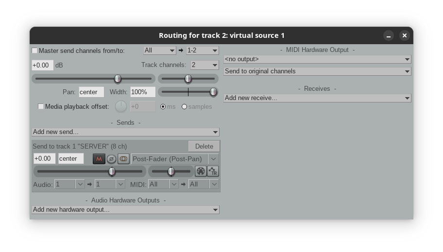
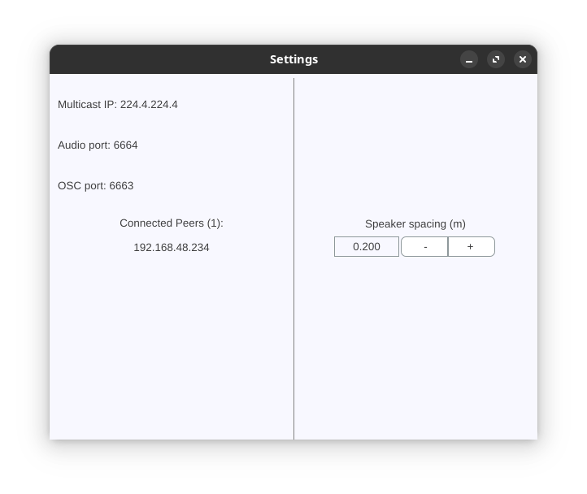
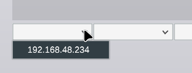

# WFS Plugin

A VST plugin implementation encompassing the networked audio server, plus a
multicast UDP server for OSC-based control data for controlling a distributed
Wave Field Synthesis installation. Accompanying microcontroller-based client can
be found [here](https://github.com/hatchjaw/netjuce-teensy).

## Usage

Instructions apply to Linux and the [Reaper](https://www.reaper.fm/) digital 
audio workstation; similar principles should apply for Mac, and other DAWs, but 
Reaper on Linux (Manjaro, Ubuntu) is, at present, the only tested platform.

### Create and configure an audio track

Create an audio track (_Insert &rightarrow; Track, ctrl+T)_, double-click the 
black region to the right of the _Record Arm/Disarm_ button, and name the track 
"SERVER". Click the track's striped routing icon (_Sends, Receives, and Hardware 
Output Options_).

Set _Track channels_ to 8 and uncheck _Master send channels 
from/to_; our audio track need not produce any output of its own.

### Add an instance of the plugin

Click the track's _FX_ icon and add an instance of _VST3: njWFS_. The plugin
interface will appear.

#### The plugin interface

The interface consists of the following elements:

1. A large, grey, rectangular region representing a virtual sound field;
2. Coloured, numbered nodes representing (currently unassigned) virtual sound 
   sources; the positions of the nodes in the virtual sound field can be altered
   manually, or via parameter automation.
3. Dropdown menus at the bottom of the interface representing the positions of 
   client instances, the boundary between the virtual and _real_ sound fields.
4. A master gain control.
5. A settings button. Clicking on the settings button reveals a modal window
   which displays:
6. The designated UDP multicast IPv4 address. 
7. Destination port numbers for audio and OSC data.
8. A list of connected "peers" or "No peers connected" if none are present.
9. A number-entry box for setting the speaker spacing corresponding with that 
   of your WFS system.

### Assign a virtual sound source

Create another audio track, and assign a mono media file to it (_Insert -> Media
Item_). Click the track's routing icon, and again uncheck _Master send channels 
from/to_. Beneath _Sends_, click _Add new send_ and select "1: SERVER". Use the 
dropdown menus at the bottom right (labelled _Audio_) to route _Mono source_ 1 
to channel 1 of the server.

The monophonic source associated with this track is now also associated with the
node 1 in the WFS plugin interface. Up to eight virtual sources can be created
by assigning sends to each of the eight corresponding input channels of the 
track hosting the WFS plugin.

### Assign a client to a position in the speaker array

Clients that join the multicast group will appear, identified by their IP
address, in the list of _Connected Peers_ in the settings window:

Use the dropdown menus below the virtual sound field to assign a client to a
position in the WFS array:

